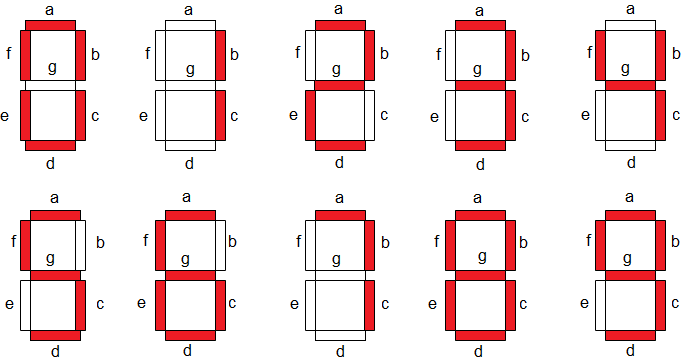

## Analogové hodiny ⏰

Máme 3 analogové hodiny (pojmenované `T1`, `T2`, a `T3`), na každých hodinách může být zobrazen čas. Zobrazují se hodiny minuty i vteřiny.

_Pokud je tedy pravé poledne na hodinách T1, ukazují všechny ručičky ciferníku od středu vzůru._

Zadaný čas je omezený a to tak, že ručička hodin/minut/sekund ukazuje jen nahoru, dolů, vlevo nebo vpravo.

_Například hodina na vstupu může být jen 0, 3, 6, 12, 15 nebo 18._

Pro zjednodušení je natočení hodinové ručičky ignoruje hodnotu minut, stejně tak natočení minutové ručičky není nijak ovlivněno hodnotou zadané sekundy.

Vaším úkolem je zjistit, jaké číslo `D` 0 - 9 zobrazují ciferníky analogových hodin pokud ciferníky umístíme na jednoduchý sedmisegmentový displej. Číslo `D` zjistíme tak, že ciferníky na všech hodinách natočíme na správnou lokaci a zjistíme, které segmenty jsou překryté ručičkami.



### Rozmístění analogových hodin lze vidět na ilustraci.
- Hodiny `T1` jsou v pravém horním rohu a mohou nastavovat segmenty `a` a `b`.
- Hodiny `T2` jsou v pravém dolním rohu a mohou nastavovat segmenty `c` a `d`.
- Hodiny `T3` jsou v levém středu a mohou nastavovat segmenty `f`, `g` a `e`.

### Definice vstupu
Na vstupu programu je čas ve formátu `HH:MM:SS` pro hodiny `T1`, `T2`, a `T3`.

Každý čas je na samostatném řádku.

Některé hodiny nemusí zobrazovat žádný čas, v tomto případě bude místo HH:MM:SS zobrazena hodnota broken.

## Ukázka #1

### Ukázka vstupu
```
clock-1: 09:45:30
clock-2: 12:00:45
clock-3: 03:00:00
---
```

### Ukázka výstupu

```
9
```

## Ukázka #2

### Ukázka vstupu
```
clock-1: 06:30:30
clock-2: 00:00:00
clock-3: broken
---
```

Na vstupu může být také více číslic k rozpoznání. Pokud za posledním časem T3 následuje řádek rovný jedné pomlčce-, bude následovat zadání pro další číslici.

Tři pomlčky --- značí konec vstupu

### Ukázka výstupu

```
1
```

## Ukázka #3

### Ukázka vstupu
```
clock-1: 06:45:30
clock-2: 00:45:45
clock-3: 03:00:00
-
clock-1: 09:30:30
clock-2: 21:00:00
clock-3: 15:15:15
-
clock-1: 06:45:45
clock-2: 21:45:45
clock-3: 06:15:30
---
```

### Ukázka výstupu

```
932
```