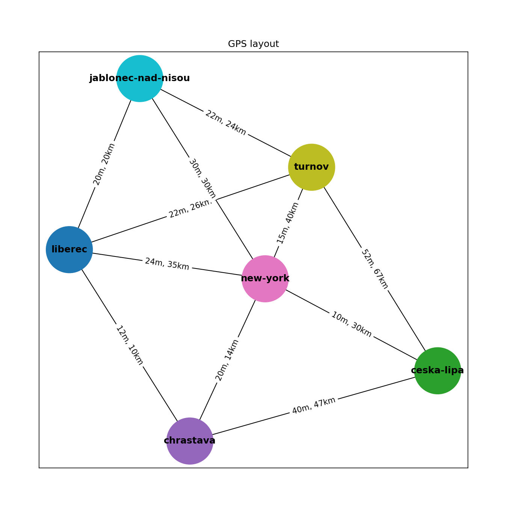

Vaším úkolem je vzít na sebe roli navigačního systému a zjistit, jaká cesta je pro řidiče ta nejvhodnější. Pokročilý navigační systém umožňuje dva způsoby navigování.

1. Nejlepší cesta (tj. ta, která trvá nejméně času)
2. Nejkratší cesta (tj. ta, která má nejkratší konečnou trasu)

Na vstupu jsou nejprve uvedeno město, z kterého chceme cestovat a následně je uveden cíl naší trasy. Jako poslední argument je režim, ve kterém navigace operuje (buď `nejkratsi`, nebo `nejlepsi`).

## Ukázka vstupu 1

```
ceska-lipa chrastava nejkratsi
```

## Ukázka výstupu 1

```
(30 min, 44 km) ceska-lipa -> new-york -> chrastava
```

## Ukázka vstupu 2

```
chrastava turnov nejlepsi
```

## Ukázka výstupu 2

```
(34 min, 36 km) chrastava -> liberec -> turnov
```

Zjednodušená mapa vypadá takto:


## Údaje v jiné podobě
- názvy měst:
```
["liberec", "ceska-lipa", "chrastava", "new-york", "turnov", "jablonec-nad-nisou"]
```

- čas dojezdu (hodnota `999` znamená, že spojení neexistuje):
```
[
    [999,999, 12, 24, 22, 20], 
    [999,999, 40, 10, 52,999], 
    [ 12, 40,999, 20,999,999], 
    [ 24, 10, 20,999, 15, 30], 
    [ 22, 52,999, 15,999, 22], 
    [ 20,999,999, 30, 22,999]
]
```

- vzdálenost mezi městy (hodnota `999` znamená, že spojení neexistuje)

```
[
    [999,999, 10, 35, 26, 20], 
    [999,999, 47, 30, 67,999], 
    [ 10, 47,999, 14,999,999], 
    [ 35, 30, 14,999, 40, 30], 
    [ 26, 67,999, 40,999, 24], 
    [ 20,999,999, 30, 24,999]
]
```