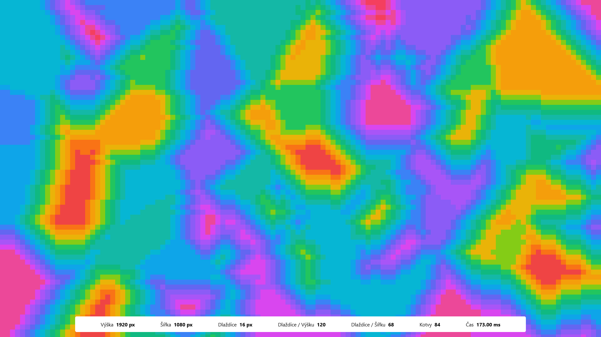

# Semestrální práce NTI/ALD 2022

Cílem práce bylo vytvořit systém, který bude generovat náhodné uspořádání prvků "herního světa".

## Upřesnění zadání
Jelikož bylo zadání demonstrováno na problému dlaždic, kde každá nesla omezení na směr, kterým může algoritmus pokračovat. Jelikož jsem chtěl být trochu originálnější, zvolil jsem následující problém:
- Program má k dispozici posloupnost barev
- Každá barva může ve světe existovat pouze vedle takové barvy, se kterou "sousedí" v posloupnosti (takže $a_{n-1}$ nebo $a_{n+1}$)

## Návrh řešení

### Náhodnost každé generace
Při každém běhu programu se vygeneruje $n$ počet tzv. **kotvících bodů**, které slouží jako záchytné body pro vykreslení tzv. **zón**. Každá zóna je definována jedním kotvícím bodem, a patří do ní takové body, které jsou svou euklidovskou vzdáleností nejblíže k jejímu kotvícímu bodu.

Každý kotvící bod má přiřazené náhodné (unikátní) souřadnice a náhodnou barvu. Efektivně se tak vygeneruje mozaiku "náhodného" tvaru z "náhodných" barev.

### Splnění omezení
Po vygenerování máme sice barvy a tvary, ovšem není zaručeno, že splňují omezení na incidenci barev.

Nápadů, jak tento požadavek splnit, bylo několik:
- Jednou z možností, která mě napadla, byla **bilineární interpolace**. Bohužel ta má jednu zásádní nevýhodu, která pro tento případ je kritická, a to je, že nedokáže extrapolovat mimo definovanou oblast. Vzhledem k tomu, že mám náhodně rozmístěné body, nechává dost bodů nedefinovaných. Buďto bych musel generovat bodové rohy, což by mi nedalo takovou svobodu, kterou bych chtěl, nebo bych musel generovat interpolací pouze část, a zbytek "nějakým způsobem dodělat".
- Další možností bylo **použití "spojitého" šumu**, jehož vzorky by mi zajistily plynulost přechodu mezi barvami. Prvně jsem šáhnul po Perlinově šumu, který ale nepřinesl požadované výsledky. Vzhledem k postatě těchto šumů mi ve finále nepřipadalo jako ideální řešení a tuto cestu jsem zanedbal.
- Poslední možností bylo **použití backtracking algoritmu**, který by měnil barvy kotvících bodů tak, aby "přímí sousedi" měli barvy, které by splnily omezení. Problém s touto metodou vystal v určení přímých sousedů.

Nakonec jsem skončil u poněkud jednoduššího řešení. Algoritmus počítá **zpětnou diferenci mezi pixely** a hledá změnu větší než 1. Pokud taková změna nastane, je aktuální (dopřední) pixel nahrazen barvou, která je o jedna vyšší či menší než zpětný pixel. O tom, jestli je nová barva o jednu vyšší nebo menší, rozhoduje znaménko diference. Tento proces počítání diference se provádí zleva doprava, a následně ze zhora dolů (tedy dvakrát).

## Výsledek programu
Výsledkem programu je rádoby heat mapa, která by se dala použít buďto jako height mapa, nebo namapovat na jednotlivé textury herního světa. Pro lepší vizuální reprezentaci jsem ovšem ponechal barvy. 
